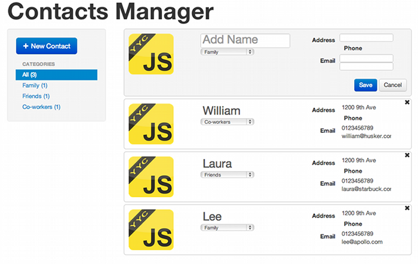

# JavaScript like

---

## Contacts application

---

## Google Dart

---

## [Google Dart](http://www.dartlang.org)

> Dart brings structure to web app engineering with a new language, libraries, and tools

- Class based
- Object oriented
- Typed (optional)
- Compiles to JavaScript

To get started:

- [Download the SDK](http://www.dartlang.org/downloads.html) (comes with Chromium browser)
- [Check out the language tour](http://www.dartlang.org/docs/dart-up-and-running/ch02.html)
- [Language spec](http://www.dartlang.org/docs/spec/latest/dart-language-specification.html)

---

## CoffeeScript

---

## CoffeeScript

### A rubyish-pythonesque-javascriptish language that compiles to javascript. Basically it makes your code less verbose.

Functions can be created rubyishly:

    !javascript
    square = (x) -> x * x

Great features for making functions with arbitrary-length argument list:

    !javascript
    awardMedals = (first, second, others...) ->
      //do stuff with the arguments!

Gotta love awesome pythonic list comprehensions

    !javascript
    eat food for food in ['toast', 'cheese', 'wine']

Countdown:

    !javascript
    countdown = (num for num in [10..1])

---

## CoffeeScript

Cool array slicing features

    !javascript
    numbers = [1, 2, 3, 4, 5, 6, 7, 8, 9]
    start   = numbers[0..2]

It also has classes, inheritance and super

And more... (which is my way of saying that I'm running out of time and need some more hands on this)

---

## Microsoft TypeScript

---

## What is TypeScript?

#### From the TypeScript Site:

* TypeScript is a language for application-scale JavaScript development.
* TypeScript is a typed superset of JavaScript that compiles to plain JavaScript.
* Any browser. Any host. Any OS. Open Source.

---

## TypeScript Example

    !html
    <!DOCTYPE html>
    <html>
      <head><title> TypeScript Greeter </title></head>
      <body>
        
      </body>
    </html>

---

## TypeScript Example Continued...

    !javascript
    class Greeter {
       constructor(public greeting: string) { }
       greet() {
           return "<h1>" + this.greeting + "</h1>";
       }
    };
    var greeter = new Greeter("Hello, world!");
    var str = greeter.greet();
    document.body.innerHTML = str;

---

## TypeScript: Up and Running

* `npm install -g typescript`
* Write your code with a `.ts` file extension
* Compile your typescript `tsc your_file.ts`
* Include your compiled JS files like usual ``

#### If you like Visual Studio

Go to [the TypeScript tutorial](http://www.typescriptlang.org/Tutorial/)

---
